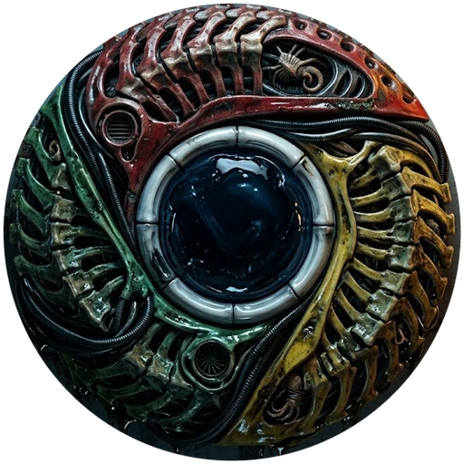

<p align="center">
  
</p>

<h1 align="center">UltraLightBrowser 🚀</h1>

<p align="center">
  <b>Ultra-Fast, Minimal, and Hardware-Optimized Windows 11 Native Browser Shell</b><br>
  Powered by Microsoft Edge WebView2 Evergreen Runtime & Modern C++20.
</p>

<p align="center">
  <a href="https://github.com/Freecode100Year/UltraLightBrowser/releases"></a>
  <a href="https://github.com/Freecode100Year/UltraLightBrowser/releases/download/v1.1.8/UltraLightBrowser.exe"></a>
  <a href="https://github.com/Freecode100Year/UltraLightBrowser/stargazers"></a>
  <a href="https://github.com/Freecode100Year/UltraLightBrowser/network/members"></a>
  <a href="https://github.com/Freecode100Year/UltraLightBrowser/issues"></a>
  <a href="https://github.com/Freecode100Year/UltraLightBrowser/releases"></a>
  <a href="https://microsoft.com"></a>
  <a href="https://isocpp.org"></a>
  <a href="LICENSE"></a>
</p>

---

## 📥 便携版下载 / Direct Download

可以在 GitHub Releases 中直接获取预编译的可用二进制程序：

* 🚀 **[下载独立可执行程序 (UltraLightBrowser.exe)](https://github.com/Freecode100Year/UltraLightBrowser/releases/download/v1.1.8/UltraLightBrowser.exe)**（推荐：单文件，双击即用）
* 📦 **[下载便携完整压缩包 (UltraLightBrowser-v1.1.8-windows-x64.zip)](https://github.com/Freecode100Year/UltraLightBrowser/releases/download/v1.1.8/UltraLightBrowser-v1.1.8-windows-x64.zip)**
* 🔗 **[查看所有历史版本与 Release 资产](https://github.com/Freecode100Year/UltraLightBrowser/releases)**

---

## 📖 Overview

**UltraLightBrowser** is an engineered, bloatware-free Windows 11 desktop browser designed for extreme responsiveness, minimal memory footprint, and full hardware acceleration.

Unlike typical Electron or monolithic Chromium browsers that consume hundreds of megabytes at rest, UltraLightBrowser builds directly upon Windows 11 native Win32 APIs, Per-Monitor V2 High-DPI scaling, and the system-installed Microsoft Edge WebView2 Evergreen Runtime.

---

## ⚡ Key Highlights & Benchmarks

| Metric | Target / Measured | Technical Driver |
| :--- | :--- | :--- |
| **Binary Footprint** | `~300 KB` (Single standalone `.exe`) | Zero-bloat Win32, MSVC `/O2 /GL /LTCG /OPT:REF /OPT:ICF` |
| **Cold Startup Time** | `<= 0.3s` | Native Win32 window loop, async WebView2 environment spin-up |
| **Idle / Minimized RAM** | `~20 MB` (Host process working set) | `EmptyWorkingSet` & `ICoreWebView2_3::TrySuspend` on minimize (Note: Chromium renderers scale per webpage) |
| **Display Scaling** | Crisp 4K/8K HiDPI | `DPI_AWARENESS_CONTEXT_PER_MONITOR_AWARE_V2` |
| **Visual Style** | Native Windows 11 | Immersive Dark Mode (`DWMWA_USE_IMMERSIVE_DARK_MODE`) & Rounded Corners |

---

## 🛠️ Architecture & Directory Structure

```text
UltraLightBrowser/
├── CMakeLists.txt              # MSVC 2022 & C++20 maximum optimization build definition
├── vcpkg.json                  # Modern C++ package manager dependencies (WIL, nlohmann-json)
├── packages.config             # NuGet alternative dependency manifest
├── LICENSE                     # MIT License
├── README.md                   # Complete architectural and usage guide
├── resources/
│   ├── app.manifest            # Per-Monitor V2 DPI, UTF-8 code page & Windows 11 OS compatibility
│   └── resource.rc             # Win32 resource definitions
└── src/
    ├── main.cpp                # Win32 wWinMain, High-DPI initialization, and message pump
    ├── MainWindow.hpp/.cpp     # Native Win32 dark frame, Segoe UI toolbar & accelerator dispatch
    ├── WebViewManager.hpp/.cpp # WebView2 Evergreen composition, GPU flags & lifecycle
    ├── DnsManager.hpp/.cpp     # Public DNS (IPv4/IPv6/DoH) management, registry & preferences sync
    ├── ElementBlocker.hpp/.cpp # Zero-flicker pre-render CSS injection & interactive DOM picker
    ├── PowerManager.hpp/.cpp   # EcoQoS suppression, thread priority elevation & memory trimming
    └── Config.hpp/.cpp         # Thread-safe JSON persistence for blocklist & settings
```

---

## 🚀 Core Features

### 1. 🏎️ Extreme Hardware Acceleration & Network Optimization
Through `WebViewManager`, the browser injects deep Chromium performance arguments on environment creation:
* **GPU Rasterization & Zero-Copy**：`--enable-gpu-rasterization --enable-zero-copy --enable-accelerated-video-decode` 启用完整硬件解码与零拷贝渲染，保证高清/4K 视频播放丝滑流畅、不掉帧、低功耗。
* **DirectComposition & Presentation**：原生 DirectComposition 交换链集成，跨多显示器 DPI 自适应无损渲染。
* **AI Super Resolution**：`--enable-features=NvidiaVsr,IntelVsr,Prerender2,DnsOverHttps`
* **Low-Latency Transport**：`--enable-quic --enable-async-dns` 零延迟异步 DNS 与 QUIC 快速传输。
* **Bloatware Purge**：`--disable-features=Translate,OptimizationHints,MediaRouter --no-first-run` 彻底剔除遥测与后台多余组件。

### 2. 🌐 公共 DNS 服务器（支持 IPv4 / IPv6 / DoH 加密防劫持）
内置专业公共 DNS 管理中心，一键切换知名国内外优质公共 DNS 服务商，彻底杜绝运营商 DNS 劫持与污染：
* **知名服务商全覆盖**：
  * **阿里公共 DNS (AliDNS)**：IPv4 `223.5.5.5` / `223.6.6.6`，IPv6 `2400:3200::1` / `2400:3200:baba::1`，DoH `https://dns.alidns.com/dns-query`
  * **腾讯 DNSPod (Public DNS)**：IPv4 `119.29.29.29` / `182.254.116.116`，IPv6 `2402:4e00::` / `2402:4e00:1::`，DoH `https://doh.pub/dns-query`
  * **百度公共 DNS (Baidu DNS)**：IPv4 `180.76.76.76` / `180.76.76.77`，IPv6 `2400:da00::6666` / `2400:da00::6667`，DoH `https://doh.bce.baidu.com/dns-query`
  * **114 DNS (南京信风)**：IPv4 `114.114.114.114` / `114.114.115.115`，DoH `https://114.114.114.114/dns-query`
  * **Cloudflare (1.1.1.1 极速隐私)**：IPv4 `1.1.1.1` / `1.0.0.1`，IPv6 `2606:4700:4700::1111` / `2606:4700:4700::1001`，DoH `https://cloudflare-dns.com/dns-query`
  * **Google Public DNS (8.8.8.8)**：IPv4 `8.8.8.8` / `8.8.4.4`，IPv6 `2001:4860:4860::8888` / `2001:4860:4860::8844`，DoH `https://dns.google/dns-query`
  * **Quad9 (9.9.9.9 恶意威胁拦截)**：IPv4 `9.9.9.9` / `149.112.112.112`，IPv6 `2620:fe::fe` / `2620:fe::9`，DoH `https://dns.quad9.net/dns-query`
  * **Cisco OpenDNS**：IPv4 `208.67.222.222` / `208.67.220.220`，IPv6 `2620:119:35::35` / `2620:119:53::53`，DoH `https://doh.opendns.com/dns-query`
  * **CNNIC SDNS (国家互联网络信息中心)**：IPv4 `1.2.4.8` / `210.2.4.8`，DoH `https://doh.sdns.cn/dns-query`
  * **自定义 DNS / DoH**：自由填入任意标准 DoH 节点 URI。
* **双模快捷操作**：
  * 工具栏快捷菜单：点击 `[ 🌐 DNS ]` 按钮可一键开启/关闭公共 DNS，或直接单选切换服务商。
  * 完整设置面板：提供完整的 IPv4/IPv6 地址展示、一键复制单条或全部 IP 节点与 DoH 地址自定义。
* **双重内核级同步应用**：自动将安全 DNS 策略同步写入 `HKCU\SOFTWARE\Policies\Microsoft\Edge\WebView2` 注册表策略以及 Chromium 用户配置 `UserData/Default/Preferences`，保障权威解析与隐私安全。

### 3. 🔒 退出时强制清除所有缓存与临时文件（零痕迹无痕浏览保障）
真正做到无痕私密安全，关闭浏览器时即刻执行多层深度粉碎清理，不留任何浏览历史与临时文件：
* **实时内核级数据擦除**：窗口关闭时首先触发 `ICoreWebView2Profile2::ClearBrowsingDataAll`，在进程退出前完整清理 HTTP 缓存、Cookies、浏览历史、密码自动填充、IndexedDB 及全部 DOM 存储。
* **进程级优雅同步关闭**：追踪底层 Chromium 渲染主进程 PID，关闭 WebView 控制器后等待子进程释放文件句柄，杜绝文件被占用锁定。
* **物理级磁盘目录粉碎**：深入 `%LOCALAPPDATA%\UltraLightBrowser\UserData` 目录，递归销毁包括 `EBWebView` 缓存、`GPUCache`、`Code Cache`、`DawnWebGPUCache`、`ShaderCache`、`Crashpad` 日志等在内的所有运行时产生的残留文件。
* **开机/启动二次冗余清理**：每次启动浏览器时，在内核初始化前均自动执行全盘冗余清理，确保即便遭遇系统断电或任务管理器强制结束，旧会话也绝不留存任何痕迹。
* **延时静默自清理兜底**：配套独立的延时无窗口后台自毁任务，确保即使极少数字节被杀毒软件异步扫描，也能在退出后瞬间彻底清除。

### 4. 🛡️ Zero-Flicker Element Hiding & Interactive Picker
`ElementBlocker` ensures user privacy and ad-blocking without layout shifts:
* **Pre-Render Injection**: Injects domain-matched CSS rules via `AddScriptToExecuteOnDocumentCreated` before DOM construction, preventing ad flash.
* **Interactive DOM Picker (`Ctrl + Shift + H`)**: Injects an element inspector with red outlines; clicking an element computes its optimal CSS selector and saves it directly to local JSON storage.

### 5. 🔋 Power & WorkingSet Memory Optimization
`PowerManager` dynamically manages system and child processes:
* **EcoQoS Disabling**: Traverses process trees to disable `PROCESS_POWER_THROTTLING_EXECUTION_SPEED`, ensuring maximum frame rates and zero micro-stutters during heavy media playback.
* **Smart Memory Trimming**: On `WM_SYSCOMMAND (SC_MINIMIZE)`, signals `ICoreWebView2_3::TrySuspend` and invokes `SetProcessWorkingSetSize(GetCurrentProcess(), (SIZE_T)-1, (SIZE_T)-1)` (`EmptyWorkingSet`), purging unneeded physical pages down to ~20MB.
* **Instant Resume**: Restores execution immediately upon `SC_RESTORE` or focus.

### 6. 📺 Fullscreen HTML5 Video & Raw-Pixel Adaptive Viewport
* **HTML5 Video Fullscreen**: Full support for YouTube, Bilibili, and modern web video players. Automatically transitions the Win32 window to borderless full-screen on the active monitor, hides toolbars, and expands WebView2 bounds smoothly.
* **F11 & Escape Keyboard Control**: Seamlessly toggle fullscreen with <kbd>F11</kbd> or exit with <kbd>Esc</kbd> across both the browser frame and web contents.
* **Raw-Pixel Viewport Scaling (`COREWEBVIEW2_BOUNDS_MODE_USE_RAW_PIXELS`)**: Matches WebView2 bounds 1:1 with Win32 client area physical pixels, eliminating DIP scaling distortion and ensuring webpage layouts adapt dynamically and crisply to any window size, maximization state, or monitor DPI (100%, 125%, 150%, 200%).

### 7. 🔍 页面缩放与实时比例指示 (Page Zoom & Interactive Indicator)
* **全套快捷键支持**：
  * <kbd>Ctrl</kbd> + <kbd>+</kbd> / <kbd>=</kbd> : 放大页面（逐步放大至最高 500%）
  * <kbd>Ctrl</kbd> + <kbd>-</kbd> : 缩小页面（逐步缩小至最低 25%）
  * <kbd>Ctrl</kbd> + <kbd>0</kbd> : 一键重置页面缩放为 100%
  * <kbd>Ctrl</kbd> + 鼠标滚轮 : 原生平滑滚轮缩放
* **工具栏实时比例指示**：工具栏显式内置缩放百分比按钮（如 `🔍 100%`），与网页当前缩放比例保持双向实时同步。
* **快速预设菜单**：点击缩放按钮即可唤出原生快捷菜单，支持一键切换预设比例（25%、33%、50%、67%、75%、80%、90%、100%、110%、125%、150%、175%、200%、250%、300%、400%、500%），并在当前比例项显示勾选标。
* **双层全局按键拦截**：无论焦点在页面 DOM 内部还是在 Win32 地址栏/工具栏，快捷键均由底层直接拦截派发，实现无缝缩放体验。

---

## 💻 Building from Source

### Prerequisites
* **Operating System**: Windows 11 (x64)
* **Compiler**: Microsoft Visual Studio 2022 (with *Desktop development with C++*)
* **Build System**: CMake `>= 3.25`
* **Package Manager**: [vcpkg](https://github.com/microsoft/vcpkg) or NuGet
* **Runtime**: Microsoft Edge WebView2 Evergreen Runtime (pre-installed on Windows 11)

### Option A: Build with vcpkg (Recommended)

```powershell
# Clone the repository
git clone https://github.com/Freecode100Year/UltraLightBrowser.git
cd UltraLightBrowser

# Configure with vcpkg toolchain
cmake -B build -S . -DCMAKE_TOOLCHAIN_FILE="$env:VCPKG_ROOT/scripts/buildsystems/vcpkg.cmake"

# Build optimized Release binary
cmake --build build --config Release

# Output executable:
# .\build\Release\UltraLightBrowser.exe
```

### Option B: Build with NuGet

```powershell
# Restore NuGet packages
nuget restore packages.config -PackagesDirectory packages

# Configure with CMake
cmake -B build -S .

# Build
cmake --build build --config Release
```

---

## ⌨️ Shortcuts

* <kbd>F11</kbd> : Toggle Fullscreen Mode
* <kbd>Esc</kbd> : Exit Fullscreen / Reset Address Bar
* <kbd>Ctrl</kbd> + <kbd>+</kbd> / <kbd>=</kbd> : Zoom In (放大页面)
* <kbd>Ctrl</kbd> + <kbd>-</kbd> : Zoom Out (缩小页面)
* <kbd>Ctrl</kbd> + <kbd>0</kbd> : Reset Zoom to 100% (重置缩放)
* <kbd>Ctrl</kbd> + 鼠标滚轮 : Smooth Zoom (平滑滚轮缩放)
* <kbd>Ctrl</kbd> + <kbd>L</kbd> : Focus Address Bar
* <kbd>Ctrl</kbd> + <kbd>Shift</kbd> + <kbd>H</kbd> : Toggle Interactive Element Hiding / Picker Mode
* <kbd>Ctrl</kbd> + <kbd>R</kbd> / <kbd>F5</kbd> : Reload Current Page
* <kbd>Alt</kbd> + <kbd>←</kbd> : Navigate Back
* <kbd>Alt</kbd> + <kbd>→</kbd> : Navigate Forward

---

## ⭐ Star History

[](https://star-history.com/#Freecode100Year/UltraLightBrowser&Date)

If you find **UltraLightBrowser** useful, please give it a ⭐ on GitHub! Your support motivates continuous improvement.

---

## 📄 License

This project is licensed under the [MIT License](LICENSE).

