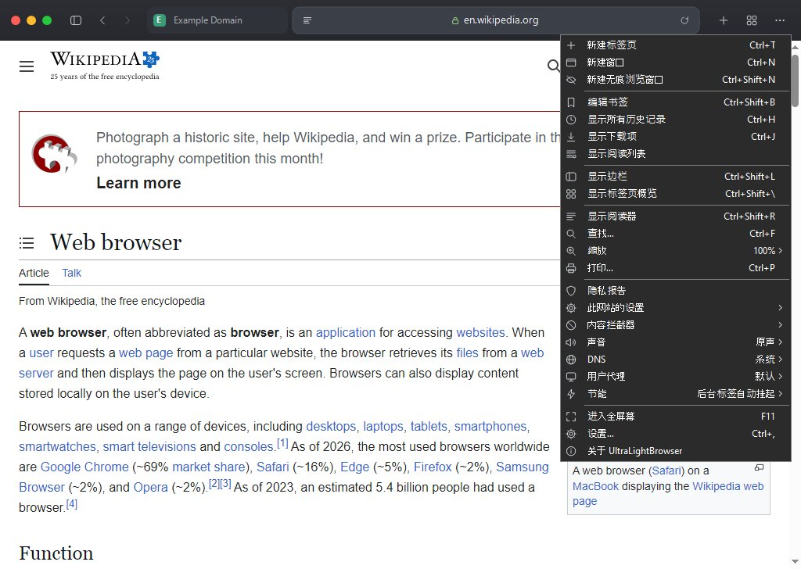
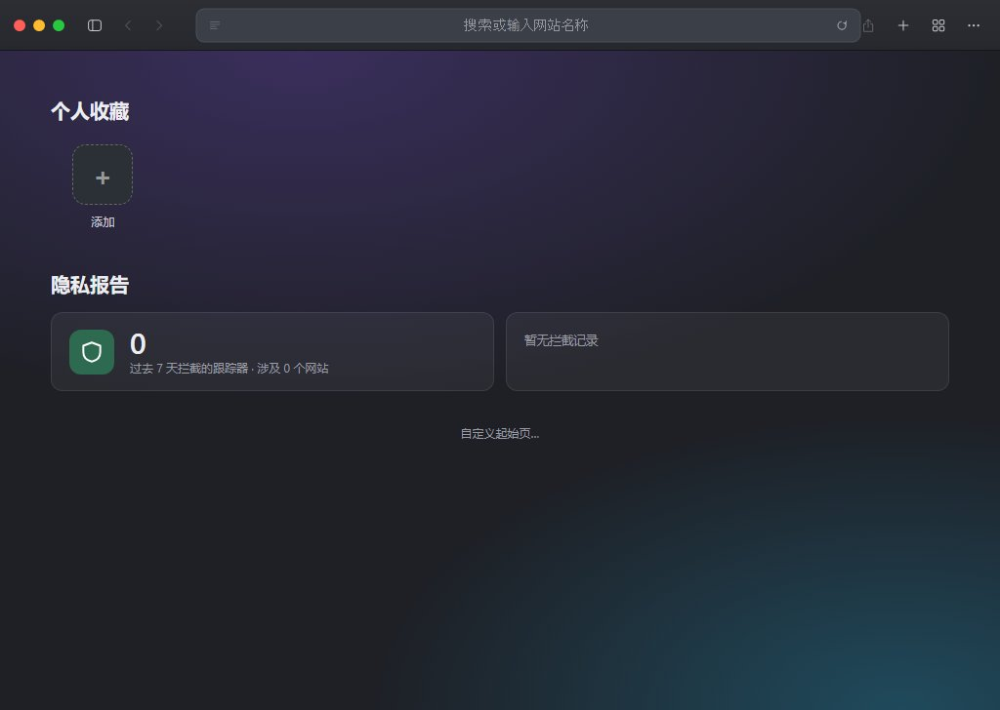
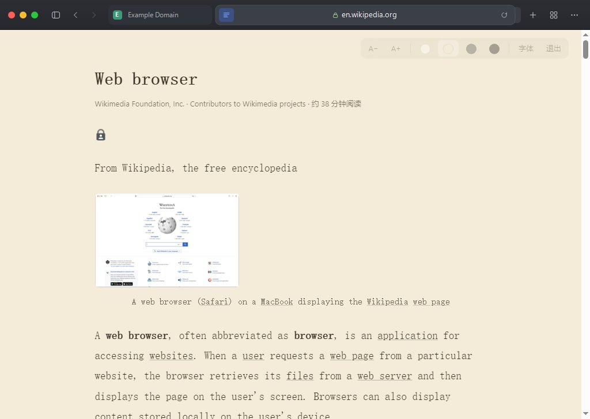
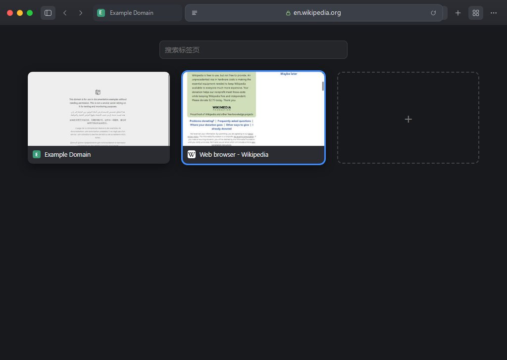
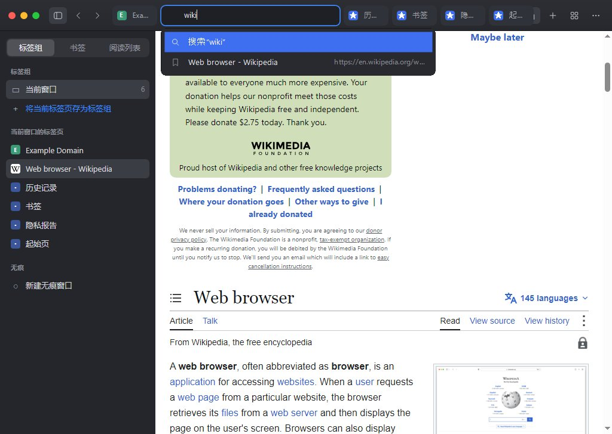

<p align="center">
  
</p>

<h1 align="center">UltraLightBrowser</h1>

<p align="center">
  极简、轻量的 Windows 原生浏览器 · Win32 + C++20 + Microsoft Edge WebView2
</p>

<p align="center">
  <a href="https://github.com/Freecode100Year/UltraLightBrowser/releases/latest"></a>
  
  
  <a href="LICENSE"></a>
</p>

<p align="center">
  
</p>

## 简介

UltraLightBrowser 是一个约 1MB 的单文件浏览器，界面仿照 macOS Safari：紧凑式标签栏（当前标签就是地址栏）、起始页、侧边栏、阅读器、标签页总览，所有选项集中在右上角一个“⋯”菜单里。界面用原生 Win32 + GDI+ 绘制，网页由系统自带的 Microsoft Edge WebView2 内核（Chromium / Blink）渲染，因此：

- 不捆绑浏览器内核，程序本体约 1MB；
- 内核随 Windows 自动更新，及时获得 Chromium 安全补丁；
- 网页兼容性与 Edge 浏览器一致。

## 下载

前往 **[Releases 最新版](https://github.com/Freecode100Year/UltraLightBrowser/releases/latest)** 下载：

| 文件 | 说明 |
| :--- | :--- |
| `UltraLightBrowser.exe` | 单文件，双击运行 |
| `UltraLightBrowser-vX.Y.Z-windows-x64.zip` | 便携压缩包 |
| `SHA256SUMS.txt` | 校验值 |

所有发布文件均由 GitHub Actions 从本仓库源码自动编译，并附带构建来源证明（artifact attestation）。下载后建议校验：

```powershell
Get-FileHash .\UltraLightBrowser.exe -Algorithm SHA256   # 与 SHA256SUMS.txt 对比
gh attestation verify .\UltraLightBrowser.exe -R Freecode100Year/UltraLightBrowser
```

运行需要 Windows 10/11 x64 和 [WebView2 Runtime](https://developer.microsoft.com/microsoft-edge/webview2/)（Windows 11 已自带）。

## 功能

<p align="center">
  
  
  
  
</p>

**标签页与窗口**
- 紧凑式标签栏：当前标签即地址栏（网站域名 + 锁），其他标签显示图标和标题；悬停可关闭，可拖动排序，标签太多时显示“+N”
- 标签页总览（Ctrl+Shift+\）：缩略图网格，可搜索、关闭、新建
- 后台标签页自动挂起（默认 10 分钟，可设置），正在播放声音的标签不挂起；标签显示播放图标，点击即可静音
- 多窗口、无痕窗口（独立的 InPrivate 数据，不记录历史）；重新打开关闭的标签页；启动时可恢复上次的标签页
- 链接右键菜单：在新标签 / 后台标签 / 无痕窗口中打开，添加到阅读列表

**统一菜单（右上角 ⋯）**
- 新建标签页 / 窗口 / 无痕窗口；书签、历史记录、下载、阅读列表
- 显示阅读器、页内查找、缩放、打印
- 隐私报告、此网站的设置、广告拦截与元素隐藏、声音、DNS、浏览器标识、节能
- 全屏、设置、关于

**起始页、书签与历史**
- 起始页：个人收藏、常去网站、隐私报告、阅读列表，可选背景与显示的板块
- 书签：文件夹、拖动排序、搜索；可导入 / 导出 HTML 书签（Chrome、Edge、Firefox、Safari 通用格式）
- 历史记录：按天分组、搜索、删除单条或按时间段清除；可在设置中关闭记录，或退出时清除
- 地址栏建议：输入时从书签和历史记录中匹配，↑↓ 选择
- 标签组（侧边栏）：把当前标签页存为一组，随时重新打开

**阅读器与查找**
- 阅读器（Ctrl+Shift+R）：基于 Mozilla Readability 提取正文，四种主题、两种字体、可调字号；可设为对某网站自动启用；文章内容在严格的内容安全策略下显示，不执行任何网页脚本
- 页内查找（Ctrl+F）：高亮全部匹配、显示“第几个 / 共几个”

**隐私与拦截**
- 内置广告 / 跟踪域名拦截（含常见国内外广告与统计服务），第三方子框架和跟踪像素同样过滤；可对单个网站关闭
- 隐私报告：过去 7 天拦截的跟踪器数量、最常见的跟踪器与网站（只保存在本机，无痕窗口不统计）
- 此网站的设置：摄像头、麦克风、位置（询问 / 允许 / 拒绝），弹出式窗口，页面缩放（按网站记忆），自动阅读器
- 开启 WebView2 严格防跟踪；Cookie、缓存和网站数据每次退出时自动清除
- 元素隐藏：Ctrl+Shift+H 点选页面元素永久隐藏
- 公共 DNS / DoH：Quad9（默认）、Cloudflare、Google、OpenDNS 或自定义 DoH；只写入本程序自己的数据目录，不修改系统或 Edge 设置

**音频**
- 默认原声输出：不接管网页音频，可配合 Windows 空间音效 / Dolby Access 使用
- 可选浏览器音频增强：对白、轻柔、标准、影院四种模式；人声增强、齿音抑制、夜间模式、单声道合并、音量放大（最高 300%）
- 播放诊断：音频增强状态、视频分辨率、缓冲余量、区间丢帧率与显示帧/秒

**节能**
- 最小化时隐藏并挂起网页、降低内存目标、启用 Windows EcoQoS；后台播放音频时不挂起
- 后台标签页按设置的时间自动挂起，切换回来时自动恢复

**浏览器标识**
- Windows Edge（默认）/ macOS Edge 两种身份，对所有标签页生效，详见下文 [macOS Edge 伪装](#macos-edge-伪装)

## macOS Edge 伪装

切换到 macOS Edge 后，网站从请求头和 JavaScript 看到的都是一台 Apple Silicon Mac 上的 Edge，各项数值彼此一致。改写通过 DevTools 协议在内核层完成，首个请求发出前就已生效。

| 检测面 | macOS 模式下的值 |
| :--- | :--- |
| `User-Agent` 请求头 / `navigator.userAgent` | `Mozilla/5.0 (Macintosh; Intel Mac OS X 10_15_7) … Edg/<本机内核版本>`，只替换系统段，版本号与内核一致 |
| Client Hints（`Sec-CH-UA-*`）/ `navigator.userAgentData` | 平台 `macOS`、版本 `26.2.0`、架构 `arm`、64 位；品牌列表和完整版本号取自本机 Edge 内核实测值（去掉 WebView2 特有的品牌项） |
| `navigator.platform` | `MacIntel` |
| WebGL / WebGPU 显卡信息 | `ANGLE (Apple, ANGLE Metal Renderer: Apple M1)` / `apple` · `metal-3` |
| 语音列表 | 隐藏 Windows 本地语音，只保留在线语音 |
| 滚动条 | 隐藏（与 macOS 默认的悬浮滚动条一致，不占布局宽度） |
| 跨进程 iframe、Dedicated Worker、Service Worker | 同样改写 UA、Client Hints 和 `platform` |
| SharedWorker | 无法改写，macOS 模式下隐藏该接口 |

被改写的函数调用 `toString()` 时仍显示为原生代码（`[native code]`）。

**自检页**：菜单“浏览器 UA 标识 → 标识自检页”会列出上述各项以及各类 Worker 中的实际取值，与 macOS 不一致的项标红。请求头与字体请另用 [BrowserLeaks](https://browserleaks.com/) 等站点核对。

**系统版本号**：默认报告 macOS `26.2.0`，可在 `%LOCALAPPDATA%\UltraLightBrowser\config.json` 的 `settings.macPlatformVersion` 中修改（仅允许数字和点）。

**局限**：无法改变系统字体（字体探测可区分 Segoe UI / 微软雅黑 与 PingFang 等）、Emoji 和 Canvas / WebGL 的实际渲染结果，专业指纹检测仍可能识别出 Windows，而“伪装过”本身也是一种特征。非必要请保持默认的 Windows 模式。

## 快捷键

| 按键 | 功能 |
| :--- | :--- |
| Ctrl+T / Ctrl+W | 新建 / 关闭标签页 |
| Ctrl+Shift+T | 重新打开关闭的标签页 |
| Ctrl+Tab / Ctrl+Shift+Tab | 下一个 / 上一个标签页 |
| Ctrl+1…8 / Ctrl+9 | 切换到第 N 个 / 最后一个标签页 |
| Ctrl+N / Ctrl+Shift+N | 新建窗口 / 无痕窗口 |
| Ctrl+L / Alt+D / F6 | 聚焦地址栏 |
| Ctrl+R / F5 | 刷新 |
| Alt+← / Alt+→ | 后退 / 前进 |
| Ctrl+F，F3 / Shift+F3 | 页内查找，下一个 / 上一个 |
| Ctrl+Shift+R | 阅读器 |
| Ctrl+D / Ctrl+Shift+D | 添加书签 / 添加到阅读列表 |
| Ctrl+Shift+B / Ctrl+H / Ctrl+J | 书签 / 历史记录 / 下载 |
| Ctrl+Shift+L | 侧边栏 |
| Ctrl+Shift+\ | 标签页总览 |
| Ctrl+, | 设置 |
| Ctrl+加号 / 减号 / 0 | 放大 / 缩小 / 实际大小 |
| F11 / Esc | 进入 / 退出全屏 |
| Ctrl+Shift+H | 元素隐藏 |

## 已知限制

- 界面没有动画效果（GDI+ 绘制）；标签组为“保存并重新打开”的简化方式，不会像 Safari 那样整组切换窗口。
- 内置页面（起始页、历史、书签等）在 `https://ulb.internal/` 下显示，网页无法跳转或嵌入这些页面。
- 浏览器音频增强基于 Web Audio：跨域且未开放 CORS 的媒体、DRM 加密视频（如 Netflix）不会被处理；切换原声 / 增强模式会刷新页面。
- 不包含 Dolby 解码器或任何 Dolby 授权技术，不保证 Atmos 输出或比特流直通。

## 从源码构建

需要 Windows、Visual Studio 2022（C++ 桌面开发）、NuGet、CMake 3.25+。

```powershell
.\build-windows.ps1          # 输出 dist\Release\UltraLightBrowser.exe
```

或手动：

```powershell
nuget restore packages.config -PackagesDirectory packages
cmake -B build -S . -G "Visual Studio 17 2022" -A x64
cmake --build build --config Release
```

更多说明见 [FULL_VERSION_GUIDE.md](FULL_VERSION_GUIDE.md)，测试见 [tests/README.md](tests/README.md)。

## 项目结构

```text
src/
├── main.cpp                 入口、DPI 初始化
├── AppShell.*               窗口管理、共享 WebView2 环境、退出清理、快捷键
├── MainWindow.cpp           窗口消息、地址栏与建议、查找栏、全屏
├── MainWindowTabs.cpp       标签页生命周期、挂起、缩略图、阅读器、网站设置
├── MainWindowPaint.cpp      标题栏 / 标签栏布局与绘制、鼠标交互
├── MainWindowMenus.cpp      “⋯”菜单、分享菜单、标签右键菜单
├── MainWindowPages.cpp      侧边栏 / 总览面板，内置页面的消息接口
├── Library.*                书签、阅读列表、历史、标签组、网站设置、隐私统计
├── InternalPages.*          内置页面资源、阅读器与查找脚本
├── Icons.*                  线条图标（标题栏与菜单）
├── WebViewManager.*         单个标签页的 WebView2、音频增强、标识切换
├── NativeRequestFilter.*    广告 / 跟踪请求拦截
├── ElementBlocker.*         元素隐藏
├── DnsManager.*             公共 DNS / DoH
├── PowerManager.*           后台节能与 EcoQoS
├── UserAgent.hpp / MacStealth.hpp / SelfTestPage.hpp   macOS 标识
└── Config.*                 设置读写
ui/                          内置页面（起始页、历史、书签、设置、隐私报告、总览、侧边栏、阅读器）
ui/vendor/                   Mozilla Readability（Apache-2.0）
tests/                       单元测试、页面资源检查、Windows 界面冒烟测试
```

## 最近更新

- **v2.0.0**：Safari 风格大改版——多标签与标签页总览、统一“⋯”菜单、起始页、书签 / 历史 / 阅读列表、阅读器、页内查找、侧边栏与标签组、无痕窗口、网站设置、隐私报告、地址栏建议、后台标签自动挂起。
- **v1.6.9**：分享菜单新增“关于”（可点击项目链接）；播放诊断增加区间丢帧率、显示帧/秒与缓冲余量，附 [2160p 播放审计](docs/2160p-playback-audit.md)。
- **v1.6.8**：修复上次选择 macOS Edge 后再次启动闪退的问题；macOS 模式不再暴露 WebView2 品牌项。
- **v1.6.7**：macOS 伪装覆盖 Service Worker 并隐藏 SharedWorker；新增标识自检页；系统版本号可配置。
- **v1.6.6**：macOS Edge 伪装改为内核层统一改写（请求头、Client Hints、WebGL、iframe、Worker）。

完整记录见 [Releases](https://github.com/Freecode100Year/UltraLightBrowser/releases)。

## 许可证

[MIT](LICENSE)。阅读器使用 [Mozilla Readability](https://github.com/mozilla/readability)（Apache-2.0，见 `ui/vendor/Readability-LICENSE.md`）。Safari 是 Apple Inc. 的商标，本项目与 Apple 无关；Dolby、Dolby Atmos 为其权利人的商标。

