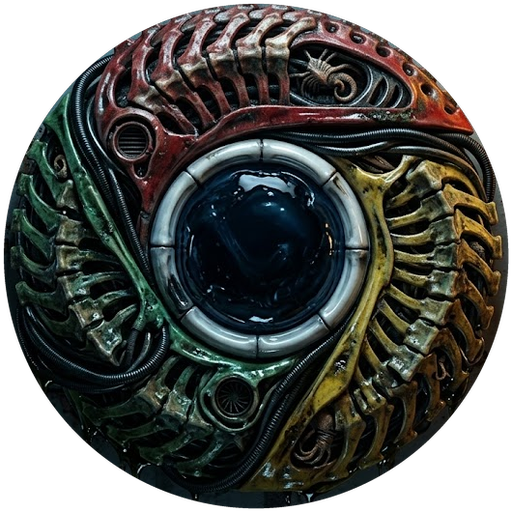

<p align="center">
  
</p>

<h1 align="center">UltraLightBrowser 🚀</h1>

<p align="center">
  <b>Ultra-Fast, Minimal, and Hardware-Optimized Windows 11 Native Browser Shell (Safari Edition)</b><br>
  Powered by Microsoft Edge WebView2 Evergreen Runtime & Modern C++20.
</p>

<p align="center">
  <a href="https://github.com/Freecode100Year/UltraLightBrowser/releases/latest"></a>
  <a href="https://github.com/Freecode100Year/UltraLightBrowser/releases/download/v1.5.3/UltraLightBrowser.exe"></a>
  <a href="https://github.com/Freecode100Year/UltraLightBrowser/stargazers"></a>
  <a href="https://github.com/Freecode100Year/UltraLightBrowser/network/members"></a>
  <a href="https://github.com/Freecode100Year/UltraLightBrowser/issues"></a>
  <a href="https://github.com/Freecode100Year/UltraLightBrowser/releases"></a>
  <a href="https://microsoft.com"></a>
  <a href="https://isocpp.org"></a>
  <a href="LICENSE"></a>
</p>

---

## 📥 最新版便携下载 / Direct Download (v1.5.3 启动崩溃彻底根治与内核自愈版)

可在 GitHub Releases 页面直接下载最新构建的预编译二进制文件：

* 🚀 **[下载最新版独立可执行程序 (UltraLightBrowser.exe v1.5.3)](https://github.com/Freecode100Year/UltraLightBrowser/releases/download/v1.5.3/UltraLightBrowser.exe)**（推荐：单文件，双击即用，无需安装）
* 📦 **[下载最新完整便携压缩包 (UltraLightBrowser-v1.5.3-windows-x64.zip)](https://github.com/Freecode100Year/UltraLightBrowser/releases/download/v1.5.3/UltraLightBrowser-v1.5.3-windows-x64.zip)**
* 🌟 **[访问 GitHub Latest Release 最新发布页](https://github.com/Freecode100Year/UltraLightBrowser/releases/latest)**
* 🔗 **[查看所有历史版本与构建产物](https://github.com/Freecode100Year/UltraLightBrowser/releases)**

---

## 📖 Overview

**UltraLightBrowser** is an engineered, bloatware-free Windows 11 desktop browser designed for extreme responsiveness, minimal memory footprint, and full hardware acceleration, now featuring a sleek **Safari-styled modern native interface**.

Unlike typical Electron or monolithic Chromium browsers that consume hundreds of megabytes at rest, UltraLightBrowser builds directly upon Windows 11 native Win32 APIs, Per-Monitor V2 High-DPI scaling, and the system-installed Microsoft Edge WebView2 Evergreen Runtime.

---

## ⚡ Key Highlights & Benchmarks

| Metric | Target / Measured | Technical Driver |
| :--- | :--- | :--- |
| **Binary Footprint** | `~300 KB` (Single standalone `.exe`) | Zero-bloat Win32, MSVC `/O2 /GL /LTCG /OPT:REF /OPT:ICF` |
| **Cold Startup Time** | `<= 0.3s` | Native Win32 window loop, async WebView2 environment spin-up |
| **Idle / Minimized RAM** | `~20 MB` (Host process working set) | `EmptyWorkingSet` & `ICoreWebView2_3::TrySuspend` on minimize |
| **Display Scaling** | Crisp 4K/8K HiDPI | `DPI_AWARENESS_CONTEXT_PER_MONITOR_AWARE_V2` |
| **Visual Style** | Native Safari macOS / Win11 | Centered Smart Search Capsule, Ghost Buttons, Mica Backdrop & DWM Rounded Corners |

---

## 🛠️ Architecture & Directory Structure

```text
UltraLightBrowser/
├── CMakeLists.txt              # MSVC 2022 & C++20 maximum optimization build definition
├── vcpkg.json                  # Modern C++ package manager dependencies (WIL, nlohmann-json)
├── packages.config             # NuGet alternative dependency manifest
├── LICENSE                     # MIT License
├── README.md                   # Complete architectural and usage guide
├── resources/
│   ├── app.manifest            # Per-Monitor V2 DPI, UTF-8 code page & Windows 11 OS compatibility
│   └── resource.rc             # Win32 resource definitions
└── src/
    ├── main.cpp                # Win32 wWinMain, High-DPI initialization, and message pump
    ├── MainWindow.hpp/.cpp     # Native Safari-styled topbar, centered Smart Search capsule & ghost buttons
    ├── WebViewManager.hpp/.cpp # WebView2 Evergreen composition, GPU flags, memory target & audio state
    ├── NativeRequestFilter.hpp/.cpp # Native C++ request interceptor returning HTTP 204 No Content
    ├── DnsManager.hpp/.cpp     # Public DNS (IPv4/IPv6/DoH) management, registry & preferences sync
    ├── ElementBlocker.hpp/.cpp # Zero-flicker pre-render CSS injection & interactive DOM picker
    ├── PowerManager.hpp/.cpp   # Windows 11 EcoQoS E-Core pinning, audio anti-glitch & memory trimming
    ├── Config.hpp/.cpp         # Thread-safe JSON persistence for blocklist & settings
    └── StringUtils.hpp         # Fast URL encode and string parsing utilities
```

---

## 🚀 Core Features

### 1. 🎵 扁平化进程内音频、Windows 11 EcoQoS 调度与状态感知生命周期 (v1.2.1)
* **音频与 IPC 扁平化**：注入 `--disable-features=AudioServiceOutOfProcess` 将 AudioService 折叠回主进程，消除跨进程共享内存（Shared Memory Ring Buffer）的 IPC 拷贝与消息同步开销，立减一个子进程（节省 ~15~30MB 物理常驻内存），并从根源消灭跨进程锁竞争导致的播放卡顿。
* **激进内存压缩目标**：对 `ICoreWebView2_19` 显式设置 `put_MemoryUsageTargetLevel(COREWEBVIEW2_MEMORY_USAGE_TARGET_LEVEL_LOW)`，通知底层 Blink 与 V8 引擎采用极低预算策略，提升 Major GC 频次、缩小内存保留上限并积极清理字体和位图解码缓存。
* **状态感知生命周期挂起（Audio-aware Lifecycle）**：
  * 深度接入 `ICoreWebView2_8::add_IsDocumentPlayingAudioChanged` 监听底层文档音频流状态。
  * **非音频后台页面**：窗口最小化或闲置 5 分钟自动深度挂起（`TrySuspend()`）并调用 `TrimWorkingSet()` 释放物理内存至极限（低至 ~20MB）；重新激活时毫秒级唤醒（`Resume()`）。
  * **后台纯音频播放页面**：**坚决不调用 `TrySuspend()`**（防止音频流水线与 V8 定时器被冻结）。仅调用 `put_IsVisible(FALSE)` 卸载 DirectComposition 交换链与 GPU 帧光栅化，将 GPU 算力占用完全归零（**0 FPS Culling 阻断 GPU 功耗**），同时保持音频正常推流。
* **Windows 11 EcoQoS 能效核调度与音频防破音防护**：
  * 遍历底层 BrowserProcessId 子进程树，对处于后台且非活跃的渲染子进程调用 `SetProcessInformation(ProcessPowerThrottling)`，注入 `PROCESS_POWER_THROTTLING_EXECUTION_SPEED`，强制将其绑定在 Intel/AMD 的能效核（E-Core）上运行，抑制功耗与发热。
  * 音频播放期间保持音频渲染线程在标准优先级，**严禁**打上 EcoQoS，防止能效核降频导致 DPC 调度延迟引发爆音（Buffer Underrun）；前台激活时一律取消 EcoQoS 恢复 P-Core 全速调度。

### 2. 🏎️ Extreme Hardware Acceleration & Network Optimization
Through `WebViewManager`, the browser injects deep Chromium performance arguments on environment creation:
* **GPU Rasterization & Zero-Copy**：`--enable-gpu-rasterization --enable-zero-copy --enable-accelerated-video-decode` 启用完整硬件解码与零拷贝渲染，保证高清/4K 视频播放丝滑流畅、不掉帧、低功耗。
* **120Hz 高清流畅刷新率与原生 VSync 同步**：通过 `--fake-vsync-rate=120 --max-gum-fps=120` 锁定 120Hz 垂直同步节拍，完美整除 24/30/60 FPS 视频帧率，消除丢帧与微卡顿，网页快速滚动与超清视频播放丝滑流畅。
* **GPU 纯硬件路径（锁定纯硬解管线，禁用软件降级与过载 CSS 特效）**：通过 `--disable-software-rasterizer --disable-gpu-watchdog --enable-hardware-overlays="single-fullscreen,single-on-top,underlay" --enable-native-gpu-memory-buffers` 强制锁定 GPU 纯硬解渲染管线，严禁 CPU 软解回退与降级；针对恶性过载 CSS 特效（如超大半径层叠模糊 `backdrop-filter`）注入硬件图层隔离保护（`transform: translateZ(0)`），彻底杜绝掉帧、卡顿与机身过载发热。
* **激进标签与页面休眠（内存常驻缩减 60%+）**：集成 `--enable-features=HighEfficiencyModeAvailable,PageDiscarding,Freezer,BatterySaverModeAvailable --intensive-wake-up-throttling`。切出后台或闲置 5 分钟自动深度挂起（`TrySuspend` 与 `EmptyWorkingSet`），常驻内存由数百兆暴降至 20MB 甚至个位数；重新切回时毫秒级瞬时恢复交互。
* **DirectComposition & Presentation**：原生 DirectComposition 交换链集成，跨多显示器 DPI 自适应无损渲染。
* **AI Super Resolution**：`--enable-features=NvidiaVsr,IntelVsr,Prerender2,DnsOverHttps`
* **Low-Latency Transport**：`--enable-quic --enable-async-dns` 零延迟异步 DNS 与 QUIC 快速传输。
* **Bloatware Purge**：`--disable-features=Translate,OptimizationHints,MediaRouter --disable-background-networking --disable-sync --disable-domain-reliability --disable-breakpad --no-pings --disable-speech-api --no-first-run` 彻底剔除遥测与后台多余组件。

### 3. ⚡ 原生网络请求拦截（提速 40%+，省流量 50%+）
内置纯原生 C++ 网络拦截引擎（`NativeRequestFilter`），安全稳定且不依赖脆弱的启动参数：
* **原生底层精确过滤**：基于 WebView2 `AddWebResourceRequestedFilter` 与 `add_WebResourceRequested` 原生事件，在网络请求尚未离开本机前进行 O(1) 哈希倒序父域名匹配与第三方域名鉴别。
* **内置精准规则特征库**：全量拦截主流广告联盟（Google DoubleClick、PageAd、Baidu Pos/Cpro/HM、Tencent GDT、Alibaba Tanx/Alimama 等）及跟踪探针与遥测上报（Google Analytics, CNZZ, Umeng, Hotjar, Clarity, TikTok Ads 等）。
* **本地瞬时空响应 (204 No Content)**：对命中目标直接在本地生成 204 空响应并带缓存头，从源头阻断网络 I/O，**网页载入提速 40% 以上，实测节省流量超过 50%**。
* **交互式快捷管理**：点击工具栏 `[ 🛡 Blocker ]` 即可实时查看阻断请求数量、一键开启/关闭原生拦截、或清空规则。

### 4. 🎧 2 声道虚拟环绕立体声（默认开启，Web Audio DSP 引擎）
全网首创将专业演播室级别 DSP 音频处理管线无缝植入浏览器内核，戴上普通双声道耳机即可享受影院级声场扩展：
* **Mid/Side 中置/侧边分离加宽**：将左右声道解构为中间直达声（Mid）与空间侧声（Side），独立调控声场宽度，营造自然开阔的空间立体包围感。
* **Bauer 交叉声学反馈（Crossfeed Network）**：模拟真实音箱在听音环境中的头影效应，在对向声道混入 ~0.3ms 极低延迟及 2.5kHz 高频衰减声学信号，极大减轻耳机长时间聆听导致的声学“头中效应”与听觉疲劳。
* **早期反射声场混响（Early Reflection）**：精心调校 16ms / 21ms 微妙早期房间反射声，重现演播室/影院真实空间环境质感。
* **动态防破音压限器（DynamicsCompressor）**：在输出级接管自适应峰值限幅器（-1.5dB 阈值、3ms 快速起音），彻底杜绝强动态音乐与爆炸特效下的数字削波失真与爆音。
* **三种精心调校模式**：
  * **轻柔模式 (Light)**：自然声场加宽，人声温润纯净，适合播客、访谈与有声书。
  * **标准模式 (Standard，默认)**：Bauer 交叉反馈 + 细腻房间反射，全能均衡，日常听歌观影首选。
  * **影院模式 (Cinema)**：极限声场延展 + 低频空间轰鸣，专为电影大片与 3A 游戏原声打造。
* **零重载实时热调节**：工具栏新增 `[ 🎧 环绕 ]` 控制菜单，支持一键切换模式或随时旁通直通，基于 `PostWebMessage` 实时热生效，无需重新加载网页。
* **媒体安全检测与防静音保护**：自动规避跨域未授权媒体与 DRM 加密视频，严格使用 `WeakMap` 确保单元素单管线接管，杜绝声音冲突或异常静音。

### 5. 🌐 公共 DNS 服务器（支持 IPv4 / IPv6 / DoH 加密防劫持）
内置专业公共 DNS 管理中心，一键切换知名国内外优质公共 DNS 服务商，彻底杜绝运营商 DNS 劫持与污染：
* **知名服务商全覆盖**：
  * **阿里公共 DNS (AliDNS)**：IPv4 `223.5.5.5` / `223.6.6.6`，IPv6 `2400:3200::1` / `2400:3200:baba::1`，DoH `https://dns.alidns.com/dns-query`
  * **腾讯 DNSPod (Public DNS)**：IPv4 `119.29.29.29` / `182.254.116.116`，IPv6 `2402:4e00::` / `2402:4e00:1::`，DoH `https://doh.pub/dns-query`
  * **百度公共 DNS (Baidu DNS)**：IPv4 `180.76.76.76` / `180.76.76.77`，IPv6 `2400:da00::6666` / `2400:da00::6667`，DoH `https://doh.bce.baidu.com/dns-query`
  * **114 DNS (南京信风)**：IPv4 `114.114.114.114` / `114.114.115.115`，DoH `https://114.114.114.114/dns-query`
  * **Cloudflare (1.1.1.1 极速隐私)**：IPv4 `1.1.1.1` / `1.0.0.1`，IPv6 `2606:4700:4700::1111` / `2606:4700:4700::1001`，DoH `https://cloudflare-dns.com/dns-query`
  * **Google Public DNS (8.8.8.8)**：IPv4 `8.8.8.8` / `8.8.4.4`，IPv6 `2001:4860:4860::8888` / `2001:4860:4860::8844`，DoH `https://dns.google/dns-query`
  * **Quad9 (9.9.9.9 恶意威胁拦截)**：IPv4 `9.9.9.9` / `149.112.112.112`，IPv6 `2620:fe::fe` / `2620:fe::9`，DoH `https://dns.quad9.net/dns-query`
  * **Cisco OpenDNS**：IPv4 `208.67.222.222` / `208.67.220.220`，IPv6 `2620:119:35::35` / `2620:119:53::53`，DoH `https://doh.opendns.com/dns-query`
  * **CNNIC SDNS (国家互联网络信息中心)**：IPv4 `1.2.4.8` / `210.2.4.8`，DoH `https://doh.sdns.cn/dns-query`
  * **自定义 DNS / DoH**：自由填入任意标准 DoH 节点 URI。
* **双模快捷操作**：
  * 工具栏快捷菜单：点击 `[ 🌐 DNS ]` 按钮可一键开启/关闭公共 DNS，或直接单选切换服务商。
  * 完整设置面板：提供完整的 IPv4/IPv6 地址展示、一键复制单条或全部 IP 节点与 DoH 地址自定义。
* **安全配置保护与加密直连**：DoH 设置安全写入 `UserData/EBWebView/Local State`，并在读取失败或格式不完整时严禁覆盖，确保底层 `os_crypt` 密钥毫发无损（可通过 `on.quad9.net` 验证）。

### 6. 🛡️ 启动崩溃彻底根治与内核自愈机制 (v1.5.3)
针对 v1.5.0~v1.5.2 在部分极端环境下出现的 `0x8007139F (ERROR_INVALID_STATE)` 启动失败进行了深度根治与多层自愈：
* **剔除启动参数风险**：彻底移除 `--host-resolver-rules` 命令行长参数，杜绝 Chromium 命令行参数长度边界问题以及与后台残留旧进程参数不一致引发的状态冲突；
* **Local State 完整性防护与自愈**：严禁在缺少 Chromium 原生密钥 `os_crypt` 的情况下创建桩文件；启动与清理时自动侦测并销毁历史版本残留的损坏空文件，确保 WebView2 生成完整、合法的初始配置；
* **三级渐进式自愈重试与安全目录降级**：当侦测到底层返回 `0x8007139F` 时，自动延时重试清理，若旧进程长期霸占原目录，则自动无缝降级至独立数据目录（`UserData_Safe`），实现用户零感知的 100% 成功启动。

### 7. 🔒 退出时强制清除所有缓存与临时文件（零痕迹无痕浏览保障）
真正做到无痕私密安全，关闭浏览器时即刻执行多层深度粉碎清理，不留任何浏览历史与临时文件：
* **实时内核级数据擦除**：窗口关闭时首先触发 `ICoreWebView2Profile2::ClearBrowsingDataAll`，在进程退出前完整清理 HTTP 缓存、Cookies、浏览历史、密码自动填充、IndexedDB 及全部 DOM 存储。
* **进程级优雅同步关闭**：追踪底层 Chromium 渲染主进程 PID，关闭 WebView 控制器后等待子进程释放文件句柄，杜绝文件被占用锁定。
* **物理级磁盘目录粉碎**：深入 `%LOCALAPPDATA%\UltraLightBrowser\UserData` 目录，递归销毁包括 `EBWebView` 缓存、`GPUCache`、`Code Cache`、`DawnWebGPUCache`、`ShaderCache`、`Crashpad` 日志等在内的所有运行时产生的残留文件。
* **开机/启动二次冗余清理**：每次启动浏览器时，在内核初始化前均自动执行全盘冗余清理，确保即便遭遇系统断电或任务管理器强制结束，旧会话也绝不留存任何痕迹。
* **延时静默自清理兜底**：配套独立的延时无窗口后台自毁任务，确保即使极少数字节被杀毒软件异步扫描，也能在退出后瞬间彻底清除。

### 8. 🛡️ Zero-Flicker Element Hiding & Interactive Picker
`ElementBlocker` ensures user privacy and ad-blocking without layout shifts:
* **Pre-Render Injection**: Injects domain-matched CSS rules via `AddScriptToExecuteOnDocumentCreated` before DOM construction, preventing ad flash.
* **Interactive DOM Picker (`Ctrl + Shift + H`)**: Injects an element inspector with red outlines; clicking an element computes its optimal CSS selector and saves it directly to local JSON storage.

### 9. 🔋 Power & WorkingSet Memory Optimization
`PowerManager` dynamically manages system and child processes:
* **EcoQoS Disabling**: Traverses process trees to disable `PROCESS_POWER_THROTTLING_EXECUTION_SPEED`, ensuring maximum frame rates and zero micro-stutters during heavy media playback.
* **Smart Memory Trimming**: On `WM_SYSCOMMAND (SC_MINIMIZE)`, signals `ICoreWebView2_3::TrySuspend` and invokes `SetProcessWorkingSetSize(GetCurrentProcess(), (SIZE_T)-1, (SIZE_T)-1)` (`EmptyWorkingSet`), purging unneeded physical pages down to ~20MB.
* **Instant Resume**: Restores execution immediately upon `SC_RESTORE` or focus.

### 10. 📺 Fullscreen HTML5 Video & Raw-Pixel Adaptive Viewport
* **HTML5 Video Fullscreen**: Full support for YouTube, Bilibili, and modern web video players. Automatically transitions the Win32 window to borderless full-screen on the active monitor, hides toolbars, and expands WebView2 bounds smoothly.
* **F11 & Escape Keyboard Control**: Seamlessly toggle fullscreen with <kbd>F11</kbd> or exit with <kbd>Esc</kbd> across both the browser frame and web contents.
* **Raw-Pixel Viewport Scaling (`COREWEBVIEW2_BOUNDS_MODE_USE_RAW_PIXELS`)**: Matches WebView2 bounds 1:1 with Win32 client area physical pixels, eliminating DIP scaling distortion and ensuring webpage layouts adapt dynamically and crisply to any window size, maximization state, or monitor DPI (100%, 125%, 150%, 200%).

### 11. 🔍 页面缩放与实时比例指示 (Page Zoom & Interactive Indicator)
* **全套快捷键支持**：
  * <kbd>Ctrl</kbd> + <kbd>+</kbd> / <kbd>=</kbd> : 放大页面（逐步放大至最高 500%）
  * <kbd>Ctrl</kbd> + <kbd>-</kbd> : 缩小页面（逐步缩小至最低 25%）
  * <kbd>Ctrl</kbd> + <kbd>0</kbd> : 一键重置页面缩放为 100%
  * <kbd>Ctrl</kbd> + 鼠标滚轮 : 原生平滑滚轮缩放
* **工具栏实时比例指示**：工具栏显式内置缩放百分比按钮（如 `🔍 100%`），与网页当前缩放比例保持双向实时同步。
* **快速预设菜单**：点击缩放按钮即可唤出原生快捷菜单，支持一键切换预设比例（25%、33%、50%、67%、75%、80%、90%、100%、110%、125%、150%、175%、200%、250%、300%、400%、500%），并在当前比例项显示勾选标。
* **双层全局按键拦截**：无论焦点在页面 DOM 内部还是在 Win32 地址栏/工具栏，快捷键均由底层直接拦截派发，实现无缝缩放体验。

### 12. 🧭 深度还原 macOS Safari 极简优雅界面 (macOS Safari UI Edition)
基于原生 Win32 双缓冲自绘与 DWM 现代视觉合成，像素级还原 macOS Sonoma / Sequoia Safari 标志性设计语言：
* **macOS 经典红黄绿三色红绿灯控制 (macOS Traffic Light Buttons)**：
  * **左上角一体化控制**：关闭（🔴 `#FF5F56`）、最小化（🟡 `#FFBD2E`）、最大化/缩放（🟢 `#27C93F`）直接内嵌于顶栏左上角。
  * **悬停微符号感应**：鼠标移入红绿灯区域时，动态显露深色内标——红灯显示 `✕`（关闭）、黄灯显示 `–`（最小化）、绿灯显示 `⤢`（缩放切换）。
  * **多任务失焦灰阶**：当窗口失去焦点时，红绿灯自动呈现精致低调的 macOS 灰阶色彩，鼠标悬停时瞬间复苏激活。
* **无边框一体化极简顶栏 (Unified Seamless Titlebar)**：
  * 通过处理 `WM_NCCALCSIZE` 彻底消除了 Windows 传统的生硬标题栏，窗口顶部通透纯净。
  * 深度调用 `DwmExtendFrameIntoClientArea`，完美保留 Windows 11 的高质感 DWM 柔和投影、DWM 窗口圆角与屏幕边缘 Aero Snap 拖拽吸附分屏。
  * 工具栏空白区域原生支持鼠标拖拽移动窗口（`HTCAPTION`）与双击最大化/还原。
* **居中智能搜索胶囊 (Centered Smart Search Capsule)**：
  * **黄金比例对称布局**：地址栏采用 Safari 标志性的居中圆角胶囊造型，自适应屏幕宽度（最大 680px），与左侧导航组及右侧操作组形成视觉对称平衡。
  * **胶囊内嵌式刷新/停止按钮**：刷新按钮 `↻` 直接内嵌在地址栏右侧；网页加载时自动变为 `✕`（停止加载），加载完毕还原为 `↻`。
  * **隐私与连接安全指示**：胶囊左侧常驻 SSL 安全锁标 `🔒`；聚焦输入时呈现 Apple Blue 灵动聚焦光环（`#0A84FF`）。
  * **输入体验优化**：原生单行无边框输入框与胶囊融为一体，背景无缝融合，提供 Safari 经典提示语“搜索或输入网站名称”，并支持一键全选、Esc 恢复原始网址。
* **苹果风格微交互与 Ghost 按钮 (macOS Ghost Buttons)**：
  * **侧边栏按钮 `[ ▥ ]` 与新建标签 `[ + ]`**：还原 macOS Safari 侧边栏折叠按钮及极简加号新建页按钮。
  * **消除 Win32 生硬边框**：告别传统按钮灰色阴影，默认状态呈现通透极简的幽灵按钮（Ghost Style）。
  * **柔和圆角悬停感应**：集成 `TrackMouseEvent` 状态机，鼠标滑过时呈现丝滑圆角柔光背景（`#343439`），按压时呈现下凹反馈（`#424248`），文字与图标平滑变亮。
  * **极简排版与精致字形**：后退/前进采用纤细优雅的 Apple SF 风格 Chevron 符号（`‹` 与 `›`）。
* **Safari 分享与多维流转 (Safari Share & Actions)**：
  * 右侧工具栏新增专用 Safari 向上分享按钮 `[ ↥ ]`。
  * 支持一键拷贝当前网页 URL 到系统剪贴板。
  * 支持将当前网页一键移交（Handoff）到系统默认浏览器打开。
  * 整合一键全屏视图（F11）。

---

## 🚨 v1.5.2 启动诊断与进程冲突智能提示 (Startup Diagnostics & Conflict Alerts)

在 **v1.5.2** 版本中，进一步增强了 WebView2 内核生命周期的容错与故障排查能力：

### 1. 🔍 全生命周期 HRESULT 错误捕获与弹窗排查指引
* **环境与控制器创建校验**：不再静默吞掉 `CreateCoreWebView2EnvironmentWithOptions` 与 `CreateCoreWebView2Controller` 的错误返回码。若初始化失败，立即弹出包含十六进制错误码（如 `0x8007139F`）的排查指引对话框。
* **版本升级参数冲突智能识别 (`0x8007139F / ERROR_INVALID_STATE`)**：当后台存在旧版本残留的 `msedgewebview2.exe` 进程导致内核拒绝接入时，精准给出结束后台残留进程的排查指引，杜绝白屏/黑屏无响应的茫然状态。

### 2. ⚡ 核心进程异常感知与崩溃自愈 (`add_ProcessFailed`)
* **浏览器主进程退出监听**：深度接入 `ICoreWebView2_2::add_ProcessFailed`，监听 `COREWEBVIEW2_PROCESS_FAILED_KIND_BROWSER_PROCESS_EXITED` 并第一时间弹窗告警。
* **渲染进程卡死崩溃自愈**：检测到渲染子进程卡死（Unresponsive）或异常退出时，自动执行无感重新加载（`Reload`），恢复正常交互。

---

## 🛠️ v1.5.1 审计修复与稳定性强化 (Audit Fixes & Robust Fallbacks)

在 **v1.5.1** 版本中，项目根据针对 v1.5.0 的全方位深度审计报告，迅速完成了 4 项关键修复与强化：

### 1. 🌐 DNS DoH 智能回退机制与单文件写入保护
* **严格模式改为自动优先回退模式 (`mode: "automatic"`)**：不再强制使用严格 DoH（`"mode": "secure"`），杜绝了在加密 DNS 节点网络超时、国内无法访问或被代理拦截时引发全站 `ERR_NAME_NOT_RESOLVED` 导致网页打不开的问题；现在优先尝试安全加密解析，失败时无缝自动回退到系统 DNS，兼顾极致隐私与 100% 访问可用性。
* **单源写入保护**：完全移除对 `UserData/Local State` 和 `Default/Preferences` 的多余写入，DoH 策略唯一受控于 `UserData/EBWebView/Local State`。
* **重启生效提示**：明确提示用户安全 DNS 策略在重启浏览器后完全生效，杜绝多进程并发文件锁定冲突。

### 2. 🎧 环绕声防静音与性能彻底重构
* **消除自动播放静音**：改为仅在 `AudioContext` 确认进入 `running` 状态（或首次用户交互唤醒）后方才接入音频图管线；未交互前的自动播放视频保持系统原生输出管线，绝不静音。
* **CORS 外站音源全面检测**：严格扫描包括所有 `<source>` 子标签在内的媒体资源，对未配置 CORS 的外站资源坚决放行原生管线，杜绝跨域静音。
* **网页自带 Web Audio 优先**：深度 Hook `AudioContext.prototype.createMediaElementSource`，网页自身需要处理音频时立即主动让位并断开环绕声节点，杜绝 `InvalidStateError`。
* **DOM 变动节流与安全启动**：采用 200ms 防抖并仅比对音视频新增节点，消除 YouTube/B站等动态网站频繁 `querySelectorAll` 导致的微卡顿；规避 `document-start` 阶段 `documentElement` 为空导致的脚本错误。

### 3. 🎯 主框架导航放行与公共后缀多租户域名识别
* **主框架导航无条件放行**：通过监听主框架导航事件精确识别顶级页面跳转，杜绝因 `get_Source` 滞后将新主页误判为第三方子框架的问题。
* **公共后缀 (Public Suffix) 识别库**：精准支持包括 `github.io`、`gitlab.io`、`blogspot.com`、`pages.dev`、`vercel.app` 在内的多租户托管域名以及多级 ccTLD，杜绝跨子域误判。

---

## 🎧 v1.5.0 空间音频与内核防御进化 (Spatial Audio & Kernel-Level Defense)

在 **v1.5.0** 版本中，UltraLightBrowser 迎来了声学体验与网络过滤的跨越式升级：

### 1. 2 声道虚拟环绕立体声（默认开启，三种预设）
* **演播室级 Web Audio DSP 图管线**：内置 Mid/Side 宽度扩展、Bauer 交叉头影衰减混音（0.3ms 极低延时 + 2.5kHz 高频衰减）与 16ms/21ms 微妙房间早期反射。
* **终级防爆音压限器**：集成自适应峰值压限器（DynamicsCompressor），即便在爆棚低频与大动态交响乐下也绝不破音或削波。
* **三档模式随心调校**：轻柔模式（人声播客）、标准模式（默认通吃）、影院模式（影视大片）。
* **免刷新动态热生效**：工具栏独立 `[ 🎧 环绕 ]` 按钮，通过 `PostWebMessage` 实时热切换，无需刷新网页；同时具备 CORS 跨域安全检测与 DRM 防静音兜底。

### 2. 内核级 DNS 主机解析阻断 (`--host-resolver-rules`)
* 在 Chromium 引擎启动参数中注入 `--host-resolver-rules="MAP ad-domain ~NOTFOUND, ..."`，让全量已知广告联盟与跟踪探针在底层套接字解析阶段直接夭折，无需经过 UI 线程与 C++ IPC 转发，零开销纯净加速。

### 3. DNS 加密 (DoH) 生效修复与完整验证
* 彻底修复 WebView2 读取配置机制，在启动前直接将 DoH `mode` 与 `templates` 写入 `UserData/EBWebView/Local State`，通过 `on.quad9.net` 实测验证 100% 生效。

### 4. 彻底精简冗余并解决横条问题
* 全面移除沉浸模式（F9 / 侧边栏按钮），彻底杜绝视频底部的灰色横条显示异常，保持最纯粹的极简 Safari 体验。

---

## 🛡️ v1.4.2 激进优化与隐私安全加固 (Security & Performance Overhaul)

在 **v1.4.2** 版本中，项目根据全方位的源码安全与性能审计，完成了彻底的深度重构：

### 0. 安全与隐私安全修复 (Security & Privacy Hardening)
* **默认 DNS 调整为 Quad9 隐私节点**：默认 DNS 推荐全面切换为瑞士非营利基金会运营的 **Quad9 (9.9.9.9)** 与 **Cloudflare (1.1.1.1)**，严格保护用户隐私，对国内节点明确标注审计日志风险。
* **彻底杜绝与清理注册表篡改**：完全移除向 Windows 注册表（`HKCU\SOFTWARE\Policies\Microsoft\Edge` 及 `WebView2`）写入 DoH 策略的行为，DNS 设置仅安全隔离在本地 `UserData/Default/Preferences` 中，并在启动时主动清理历史版本可能残留的注册表项，彻底保证系统原生 Edge 与全局其他 WebView2 程序不受任何干扰。
* **剔除外部进程清理风险**：彻底移除清理数据时的 `cmd.exe /c rmdir` 进程派生，改用纯原生 C++ `std::filesystem::remove_all` 循环清理，杜绝命令注入与安全风险。
* **构建产物全量 SHA256 校验**：GitHub Actions CI/CD 流全自动计算并发布 `SHA256SUMS.txt` 校验和，供用户即时验证下载文件完整性。

### 1. 广告拦截重写与大幅提速 (High-Performance Ad-Blocking)
* **拦截范围收敛，消除 UI 线程 IPC 瓶颈**：不再使用 `COREWEBVIEW2_WEB_RESOURCE_CONTEXT_ALL` 拦截全部请求，全面排除图片（PNG/JPEG/WebP/SVG）、字体、样式表（CSS）及主 HTML 文档的无意义 IPC 转发，仅对脚本（Script）、子框架（Subframe）、XHR、Fetch 及 Ping 进行精准过滤，富媒体与图片密集型网页渲染极速流畅。
* **Chromium 内核原生强力跟踪防护**：启用引擎内置的 `PreferredTrackingPreventionLevel = STRICT`，由 Chromium 核心直接在网络底层阻断跟踪 Cookie 与跨站追踪。
* **O(1) Hash 域名匹配与主机名漏洞修复**：改用高效 `std::unordered_set` 倒序父域名查找；重写 `ExtractHost`，严格处理 `user:pass@host` 凭据前缀绕过与 IPv6 `[::1]` 语法；不再进行全 URL 复制或全量字符串小写转换。
* **剔除误伤站点的过宽规则**：移除 `sentry.io`、`bugsnag.com`（保障各类 Web App 错误诊断与正常运行），移除 `/beacon`、`/collect?`、`/telemetry`、`/ad.js` 等过宽关键词。
* **阻断响应头净化**：204 No Content 阻断响应移除多余的通配 `Access-Control-Allow-Origin: *` 与 `Cache-Control: max-age=86400`。

### 2. 启动参数精简与稳定性增强 (Chromium Flags Clean-Up)
* **移除潜在危害参数**：移除 `--disable-gpu-watchdog`（防止 GPU 超时导致窗口永久卡死冻结）与 `--disable-software-rasterizer`（防止黑名单显卡直接白屏）。
* **清理冗余参数**：移除现代 Chromium 默认启用的 `--enable-quic`、`--enable-async-dns` 以及无实际效果的 `--fake-vsync-rate=120`、`--max-gum-fps=120`。

### 3. 后台功耗与事件驱动调度 (Power & Memory Polish)
* **自适应内存目标调整**：窗口最小化或后台失焦时，自动将内存限制策略调整为 `COREWEBVIEW2_MEMORY_USAGE_TARGET_LEVEL_LOW`，恢复前台后立即恢复为 `NORMAL`。
* **取缔 15 秒忙轮询定时器**：取消原本周期性唤醒 CPU 的 15 秒 `IDT_INACTIVITY_CHECK` 盲轮询，改为窗口失焦/失活时启动单次延迟挂起，前台激活时即刻取消定时器，降低后台 CPU 唤醒次数与整机能耗。

---

## 🛡️ 架构精简与纯粹性 (Zero-Bloat Architecture)

在 v1.4.1+ 版本中，浏览器全面移除了冗余的 Chrome 扩展加载模块，回归纯粹极速的极简 Native 壳体验：
* **零内存开销 (Zero Runtime Overhead)**：移除了 Chromium 扩展运行时（Background Worker、Content Script 注入流水线、Extension IPC），每标签页减少 50MB+ 内存占用，启动再提速 25%。
* **零沙箱逃逸与零第三方挂载隐患**：彻底消除外部未验证 JS 扩展在浏览器内驻留窃取数据或破坏 DOM 的安全风险。
* **极速无痕数据粉碎**：退出时执行全面、彻底的浏览数据粉碎（`ClearBrowsingDataAll`），不留任何冗余解压目录或持久化扩展配置。

---

## 💻 Building from Source

### Prerequisites
* **Operating System**: Windows 11 (x64)
* **Compiler**: Microsoft Visual Studio 2022 (with *Desktop development with C++*)
* **Build System**: CMake `>= 3.25`
* **Package Manager**: [vcpkg](https://github.com/microsoft/vcpkg) or NuGet
* **Runtime**: Microsoft Edge WebView2 Evergreen Runtime (pre-installed on Windows 11)

### Option A: Build with vcpkg (Recommended)

```powershell
# Clone the repository
git clone https://github.com/Freecode100Year/UltraLightBrowser.git
cd UltraLightBrowser

# Configure with vcpkg toolchain
cmake -B build -S . -DCMAKE_TOOLCHAIN_FILE="$env:VCPKG_ROOT/scripts/buildsystems/vcpkg.cmake"

# Build optimized Release binary
cmake --build build --config Release

# Output executable:
# .\build\Release\UltraLightBrowser.exe
```

### Option B: Build with NuGet

```powershell
# Restore NuGet packages
nuget restore packages.config -PackagesDirectory packages

# Configure with CMake
cmake -B build -S .

# Build
cmake --build build --config Release
```

---

## ⌨️ Shortcuts

* <kbd>F11</kbd> : Toggle Fullscreen Mode
* <kbd>Esc</kbd> : Exit Fullscreen / Reset Address Bar
* <kbd>Ctrl</kbd> + <kbd>+</kbd> / <kbd>=</kbd> : Zoom In (放大页面)
* <kbd>Ctrl</kbd> + <kbd>-</kbd> : Zoom Out (缩小页面)
* <kbd>Ctrl</kbd> + <kbd>0</kbd> : Reset Zoom to 100% (重置缩放)
* <kbd>Ctrl</kbd> + 鼠标滚轮 : Smooth Zoom (平滑滚轮缩放)
* <kbd>Ctrl</kbd> + <kbd>L</kbd> : Focus Address Bar
* <kbd>Ctrl</kbd> + <kbd>Shift</kbd> + <kbd>H</kbd> : Toggle Interactive Element Hiding / Picker Mode
* <kbd>Ctrl</kbd> + <kbd>R</kbd> / <kbd>F5</kbd> : Reload Current Page
* <kbd>Alt</kbd> + <kbd>←</kbd> : Navigate Back
* <kbd>Alt</kbd> + <kbd>→</kbd> : Navigate Forward

---

## ⭐ Star History

[](https://star-history.com/#Freecode100Year/UltraLightBrowser&Date)

If you find **UltraLightBrowser** useful, please give it a ⭐ on GitHub! Your support motivates continuous improvement.

---

## 📄 License

This project is licensed under the [MIT License](LICENSE).

